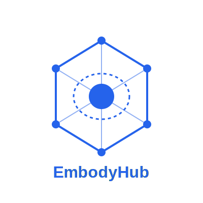

# EmbodyHub

EmbodyHub is a powerful embodied intelligence application development and management framework. It provides a unified interface for developing, testing, and deploying embodied intelligence systems, simplifying the process of integrating various AI models, sensors, and actuators into a unified application.

## Features

- Unified Embodied Intelligence Development API
- Modular Architecture for Easy Extension
- Built-in Support for Common AI Models
- Comprehensive Testing Framework
- Performance Optimization Tools
- Real-time Monitoring and Analytics
- Multi-agent Coordination Support
- Adaptive Learning Capabilities
- Extensive Sensor and Actuator Integration

## Project Architecture

```
embodyhub/
├── core/                 # Core Components
│   ├── agent.py         # Agent Implementation
│   ├── environment.py   # Environment Interface
│   ├── adapter.py       # Base Adapter
│   ├── data_manager.py  # Data Manager
│   ├── optimizer.py     # Performance Optimizer
│   ├── profiler.py      # System Profiler
│   └── monitor.py       # Real-time Monitor
├── adapters/            # Framework Adapters
│   ├── pytorch_adapter.py
│   ├── openvla_adapter.py
│   └── octo_adapter.py
└── api/                 # API Interface
    ├── behavior.py      # Behavior Analysis
    └── monitor.py       # Monitoring Interface
```

### Core Components

- **Agent**: Advanced agent implementation supporting multiple behavior strategies and learning algorithms
- **Environment**: Abstract environment interface for embodied intelligence tasks, providing standardized interaction methods
- **Adapter**: Integration interface for different AI frameworks, supporting PyTorch, OpenVLA, etc.
- **DataManager**: Handles multimodal data streams, supporting data collection, processing, and persistence
- **Optimizer**: Provides performance optimization strategies and automatic tuning capabilities
- **Profiler**: System profiling tools for performance analysis and bottleneck detection
- **Monitor**: Real-time monitoring and analytics for system performance and agent behavior

### Advanced Features

#### Multi-agent Coordination
EmbodyHub provides built-in support for multi-agent systems, enabling:
- Distributed task execution
- Agent communication and synchronization
- Resource sharing and conflict resolution
- Collective learning and adaptation

#### Adaptive Learning
- Online learning and adaptation
- Transfer learning capabilities
- Experience replay and imitation learning
- Meta-learning support

#### Performance Optimization
- Automatic hyperparameter tuning
- Resource usage optimization
- Load balancing and scaling
- Memory management

## Installation

```bash
pip install embodyhub
```

## Quick Start

### Basic Example

```python
import torch
import torch.nn as nn
from embodyhub.core.environment import Environment
from embodyhub.adapters.pytorch_adapter import PyTorchAdapter

# Define Policy Network
class PolicyNetwork(nn.Module):
    def __init__(self, input_size: int, output_size: int):
        super().__init__()
        self.network = nn.Sequential(
            nn.Linear(input_size, 64),
            nn.ReLU(),
            nn.Linear(64, output_size),
            nn.Softmax(dim=-1)
        )
    
    def forward(self, x: torch.Tensor) -> torch.Tensor:
        return self.network(x)

# Create adapter and register model
adapter = PyTorchAdapter()
model = PolicyNetwork(input_size=4, output_size=2)
adapter.register_model('policy', model)
```

### Advanced Usage

```python
from embodyhub.core.agent import Agent
from embodyhub.core.data_manager import DataManager
from embodyhub.core.optimizer import Optimizer

# Create agent with optimization
agent = Agent(
    adapter=adapter,
    data_manager=DataManager(),
    optimizer=Optimizer(),
    config={
        'learning_rate': 0.001,
        'gamma': 0.99,
        'batch_size': 64,
        'memory_size': 10000
    }
)

# Enable performance monitoring
agent.enable_monitoring()

# Train agent with optimization
agent.train(
    env,
    episodes=1000,
    optimize=True,
    eval_interval=100
)
```

## Example Projects

We provide multiple example projects demonstrating how to use EmbodyHub to build different types of embodied intelligence applications:

- [PyTorch Integration Example](examples/pytorch_example.py)
- [Multimodal Data Processing](examples/multimodal_example.py)
- [OpenVLA Integration](examples/openvla_example.py)
- [Performance Optimization](examples/optimization_example.py)
- [Multi-agent Coordination](examples/multi_agent_example.py)
- [Adaptive Learning](examples/adaptive_learning_example.py)
- [Real-time Monitoring](examples/monitoring_example.py)

## API Documentation

For complete API documentation, visit: [API Reference Guide](docs/api_reference.md)

## Integration Guide

To learn how to integrate your embodied intelligence project with EmbodyHub, please refer to: [Integration Guide](docs/integration_guide.md)

## Contribution Guidelines

We welcome community contributions! Please read our contribution guidelines before submitting a Pull Request.

### Development Environment Setup

1. Clone repository
```bash
git clone https://github.com/yourusername/embodyhub.git
cd embodyhub
```

2. Install dependencies
```bash
pip install -r requirements.txt
```

3. Run tests
```bash
python -m pytest tests/
```

### Code Standards

- Follow PEP 8 coding standards
- Write unit tests for all new features
- Provide clear commit messages
- Keep documentation up-to-date
- Use type hints and docstrings
- Follow SOLID principles
- Implement proper error handling

### Pull Request Process

1. Create a feature branch from `develop`
2. Write tests for new features
3. Update documentation
4. Submit PR with clear description
5. Pass CI/CD checks
6. Get code review approval

## License

This project is licensed under the MIT License - see the LICENSE file for details

## Contact

For questions and suggestions, please raise an Issue in the GitHub repository.

## Acknowledgments

Thanks to all developers who have contributed to EmbodyHub!

## Citing EmbodyHub

If you use EmbodyHub in your research, please cite:

```bibtex
@software{embodyhub2025,
  title = {EmbodyHub: A Framework for Embodied Intelligence Development},
  author = {EmbodyHub Contributors},
  year = {2025},
  url = {https://github.com/embodyhub/EmbodyHub}
}